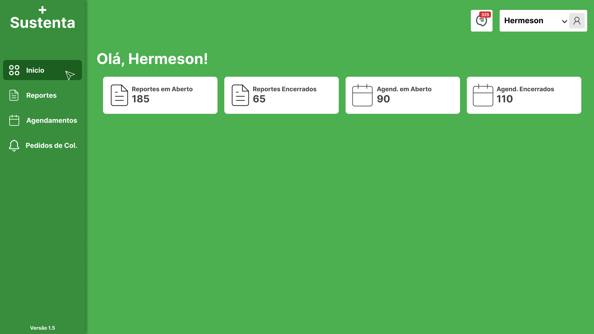
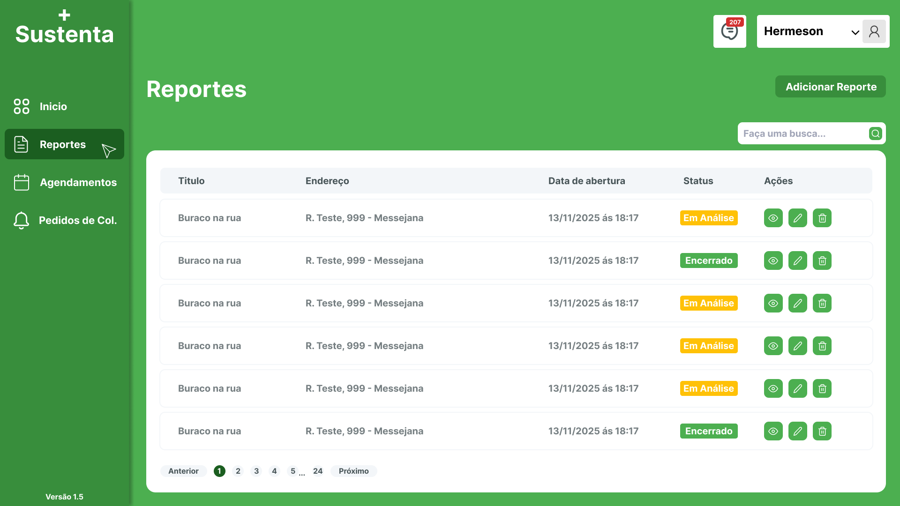

# Atividade Parcial (Projeto Aplicado a Multiplataformas Etapa 2)

## 1. Título e descrição do projeto

### Nome do sistema:
- Sustenta Plus

### Breve descrição do propósito:
- Este trabalho apresenta o desenvolvimento de uma aplicação web voltada à coleta de denúncias ambientais relacionadas ao descarte inadequado de resíduos sólidos em áreas urbanas. O sistema permite que usuários registrem ocorrências por meio de formulários estruturados e envio de imagens, armazenando as informações em um banco de dados para posterior análise.

- As denúncias são disponibilizadas em um painel administrativo acessado por representantes do setor público, possibilitando a triagem, o acompanhamento e a tomada de decisões. A aplicação visa fortalecer a participação cidadã, otimizar a gestão pública e contribuir para práticas urbanas mais sustentáveis.

### Problema solucionado:
- O problema solucionado por este sistema é a dificuldade que os cidadãos enfrentam para informar às autoridades sobre pontos de descarte irregular de lixo e falhas na coleta urbana. Muitas dessas ocorrências não são registradas oficialmente, o que dificulta a tomada de providências e contribui para a poluição e a degradação do ambiente urbano.

---

## 2. Funcionalidades implementadas

### Lista de funcionalidades principais
- Cadastro de denúncias por parte dos cidadãos através de formulário.
- Armazenamento e organização dos registros em banco de dados.
- Exibição das denúncias em um painel administrativo destinado aos órgãos responsáveis.
- Possibilidade de acompanhamento e controle das denúncias recebidas.

### Status de implementação
- Parcial

### Screenshots das telas principais



## Mais fotos
🖼️[Screenshots](./docs/screenshots/screenshots.md)

---
## 3. Tecnologias utilizadas

### Linguagens de programação
- 🔷 Typescript — Tipagem estática para maior segurança e organização do código.

### Frameworks e bibliotecas

#### Frontend
- ⚛️ React — Biblioteca para construção da interface do usuário.
- 🎨 Tailwind CSS — Estilização rápida e responsiva com classes utilitárias.

#### Backend
- 🚂 Express.js — Framework para construção da API.
- 🗄️ Sequelize — ORM para manipulação do banco de dados.

### Banco de Dados
- 🐬 MySQL

###  Ferramentas de desenvolvimento
- 🟦 VsCode

---

## 4. Arquitetura do sistema

### Visão geral da arquitetura implementada
- A aplicação foi desenvolvida utilizando uma arquitetura do tipo cliente-servidor, onde o front-end é responsável pela interface com o usuário e o back-end realiza o processamento das informações, a comunicação com o banco de dados e as regras de negócio.

### Componentes principais

#### Frontend
- Formulário de denúncia, responsável pela coleta das informações e imagens.
- Componentes de input e upload de imagens, utilizados para preencher os dados necessários.
- Página de listagem de reportes, onde é possível visualizar as denúncias registradas.

#### Backend
- Servidor Express, responsável pelo gerenciamento das rotas da aplicação.
- Controladores (Controllers), que tratam as requisições recebidas.
- Models, definidos pelo Sequelize para manipulação dos dados no banco.
- Banco de dados relacional, utilizado para armazenar as informações das denúncias.

### Integrações realizadas

#### Frontend
- React e API, por meio de requisições HTTP (GET e POST).

#### Backend
- API e banco de dados relacional utilizando o ORM Sequelize.

---

## 5. Instruções de instalação e execução

### ✅ Clonar o repositório
```bash
git clone https://github.com/HermesonxDevII/sustenta-plus.git
cd sustenta-plus
```

### **Aviso**
- A forma mais rápida e recomendada de iniciar o projeto é utilizando o Docker e o Docker Compose. A arquitetura do sistema já está totalmente conteinerizada, permitindo que a aplicação e seus serviços associados sejam inicializados com um único comando.

```bash
docker compose up --build -d
```

- Após isso basta acessar essa url:
```bash
http://localhost:8080/
```

- Para instalação manual seguir as instruções abaixo.

### Pré-requisitos
- Node.js (versão 18.x ou superior)
- TypeScript
- Yarn
- Mysql 8

### Passo a passo para instalação

#### ✅ Instalar Dependencias do Frontend
```bash
cd sustenta_plus\frontend\web
```

```bash
yarn install
```

#### ✅ Instalar Dependencias do Backend
```bash
cd sustenta_plus\backend
```

```bash
yarn install
```

```bash
npx sequelize-cli db:migrate && npx sequelize-cli db:seed:all
```

### Comandos para execução
- Rodar em ambos Frontend e Backend

```bash
yarn dev 
```

### Configurações necessárias
- Na raiz do diretorio `/Backend` tem um `.env.example`, basta renomea-lo para .env

---

## 6. Acesso ao sistema

### URL de acesso

### Credenciais de teste
| Email               | Senha   | Tipo de usuário |
| ------------------- | ------- | --------------- |
| admin@gmail.com     | 123456  | Admin           |
| user@gmail.com      | 123456  | Padrão          |
| collector@gmail.com | 123456  | Coletor         | 

---

## 7. Validação com Público-Alvo

### Definição específica do público-alvo
### Resumo do processo de validação
### Principais feedbacks recebidos
### Ajustes implementados

---

## 8. Equipe de desenvolvimento
| Nome                                     | Matricula  | Constribuição              |
| ---------------------------------------- | ---------- | -------------------------- |
| [Francisco Hermeson O. dos Santos]       | [2326241]  | Desenvolvedor(a)           |
| [Maria Joselene da Costa C. de Barcelos] | [2314797]  | Desenvolvedor(a)           |
| [Francisco Clay Oliveira]                | [2317574]  | Documentação               | 
| [Francisco Tayson Araujo santos]         | [2323799]  | Testes                     | 
| [Leonardo Estevão Silva Dos Santos]      | [2315238]  | Testes                     | 
---

## 8. Uso

### Admin
- Recebe os chamados(denuncias e agendamento de coletas) e analisa se são pedidos validos ou não para serem executados.

### User
- Abre os chamados.

### Collector
- Aceita os pedidos de coleta para serem executados.

# Notas de desenvolvimento

- Inicialmente o projeto foi dividido em dois respositorio, por isso caso queira verificar os commits das mudanças que foram sendo implementadas com o tempo abaixo segue esses dois repositórios.

- [Sustenta Plus - Frontend](https://github.com/HermesonxDevII/sustenta-plus-frontend)
- [Sustenta Plus - Backend](https://github.com/HermesonxDevII/sustenta-plus-backend)

---

## 📚 Outras documentações
- 🗄️ [Requisitos](./docs/requirements/requirements.md)
- 🔌 [Arquitetura](./docs/architecture/architecture.md)
- 🌐 [API](./docs/api/api_documentation.md)